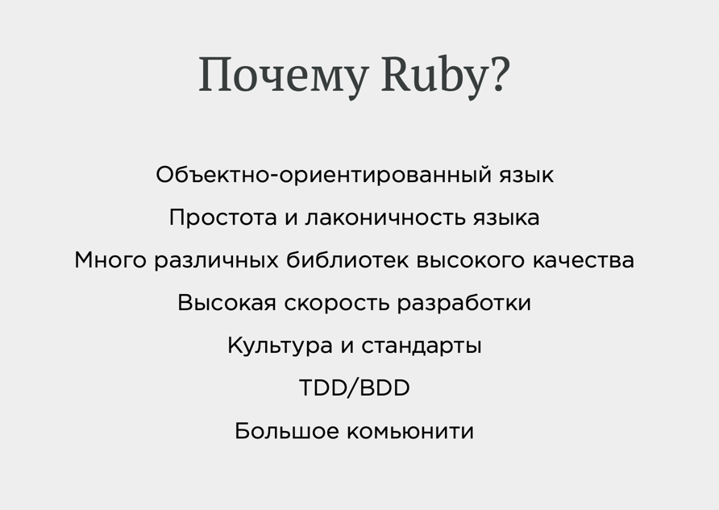
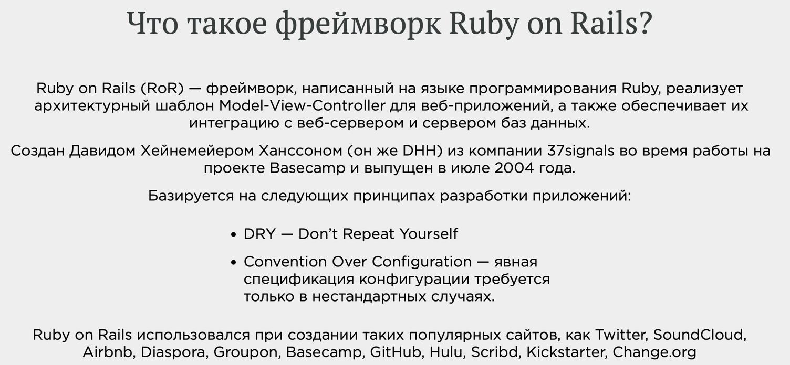

# Introduction to Ruby

## What is Ruby?
* Released in 1995 by Yukihiro Matsumoto ("Matz")
* An object oriented programming language (everything is an object)
* Open-source project in development today
* [Official website](https://www.ruby-lang.org/en/)

## Design Principles
* Ruby is a high-level language
* Ruby is an interpreted language (it does not need to be compiled, interpreter run Ruby code)
* Code is read top-to-bottom, line by line
